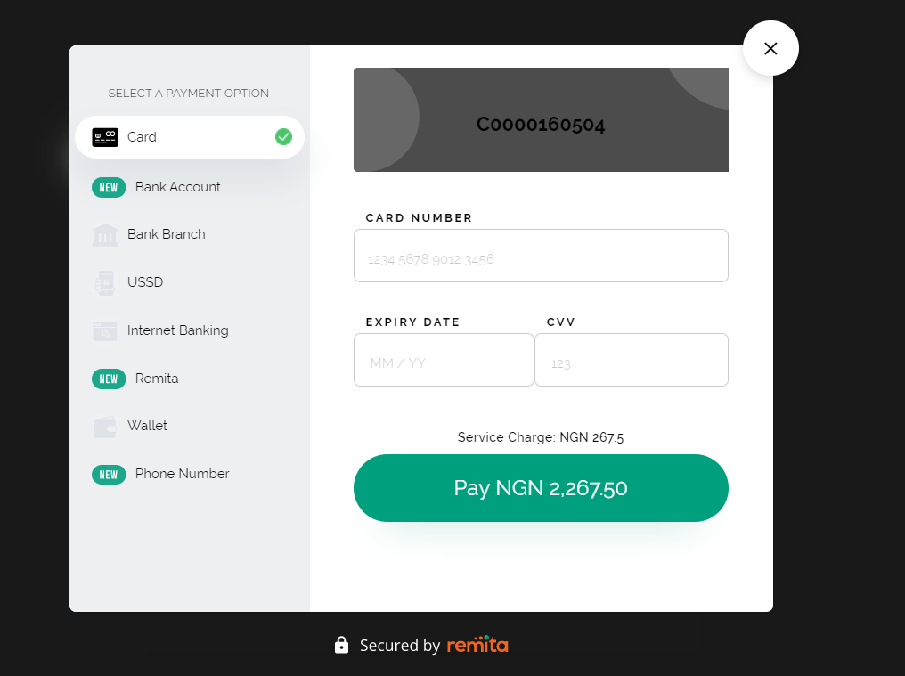

# react-remita

---
- [Overview](#Overview)
- [Installation](#Installation)
- [Usage](#Usage)
- [Contributing](#Contributing)

---
## Overview
**react-remita** a react library for integrating the Remita payment gateway.
This React library provides a wrapper to add Remita Payment Checkout to your React application




## Installation
Run the following command to install **react-remita**:

`npm install react-remita --save`


or with Yarn

sh
`yarn add react-remita`


## Usage

This library can be integrated into any react application by using a button provided by the library

### Using the Remita button

_Sample JavaScript:_
````
import "./App.css";
import RemitaPayment from "react-remita";
import { useState } from "react";

function App() {
  const [paymentData, setpaymentData] = useState({
    key: "", // enter your key here
    customerId: "",
    firstName: "",
    lastName: "",
    email: "",
    amount: null,
    narration: "",
  });
  let data = {
    ...paymentData,
    onSuccess: function (response) {
      // function callback when payment is successful
      console.log("callback Successful Response", response);
    },
    onError: function (response) {
      // function callback when payment fails
      console.log("callback Error Response", response);
    },
    onClose: function () {
      // function callback when payment modal is closed
      console.log("closed");
    },
  };

  return (
    <div className='App'>
      <div className='container'>
        <p>Pay with remita example</p>
        <input
          type='text'
          placeholder='firstname'
          onChange={(e) =>
            setpaymentData({ ...paymentData, firstName: e.target.value })
          }
        />
        <input
          type='text'
          placeholder='lastname'
          onChange={(e) =>
            setpaymentData({ ...paymentData, lastName: e.target.value })
          }
        />
        <input
          type='text'
          placeholder='email'
          onChange={(e) =>
            setpaymentData({ ...paymentData, email: e.target.value })
          }
        />
        <input
          type='text'
          placeholder='amount'
          onChange={(e) =>
            setpaymentData({ ...paymentData, amount: e.target.value })
          }
        />
        <input
          type='text'
          placeholder='description(optional)'
          onChange={(e) =>
            setpaymentData({ ...paymentData, narration: e.target.value })
          }
        />
        <RemitaPayment
          remitaData={data}
          className='btn' // class to style the button
          text='Pay with Remita' //text to show on button
          // add a 'live' prop to use the live urls/keys
        />
      </div>
    </div>
  );
}

export default App;

````

_Sample CSS Styling:_
```
body {
  margin: 0;
  font-family: -apple-system, BlinkMacSystemFont, "Segoe UI", "Roboto", "Oxygen",
    "Ubuntu", "Cantarell", "Fira Sans", "Droid Sans", "Helvetica Neue",
    sans-serif;
  -webkit-font-smoothing: antialiased;
  -moz-osx-font-smoothing: grayscale;
}
* {
  box-sizing: border-box;
}
.App {
  width: 100%;
  height: 100vh;
  display: flex;
  justify-content: center;
  align-items: center;
}
.container {
  width: 500px;
  box-shadow: 2px 3px 3px #eee;
  padding: 30px;
}
.container p {
  text-align: center;
  font-size: 16px;
}
input {
  width: 100%;
  height: 50px;
  border: 1px solid #c4c4c4;
  padding: 12px;
  font-size: 16px;
  margin-bottom: 12px;
  border-radius: 4px;
}
.btn {
  width: 100%;
  height: 50px;
  padding: 12px;
  font-size: 16px;
  margin-bottom: 12px;
  border-radius: 4px;
  background-color: rgb(71, 43, 0);
  color: #fff;
  border: 0;
}

```
You can obtain your public key by signing up on [Remita](https://remita.net) as an integrator.

## Deployment

REMEMBER TO CHANGE THE KEY WHEN DEPLOYING ON A LIVE/PRODUCTION SYSTEM AND ALSO INCLUDE THE live PROP WHEN SWITCHING TO PRODUCTION

## Contributing
- To contribute to this repo, follow these guidelines for creating issues, proposing new features, and submitting pull requests:

Fork the repository.
1. Create a new branch: `git checkout -b "feature-name"`
2. Make your changes and commit: `git commit -m "added some new features"`
3. Push your changes: `git push origin feature-name`
4. Submit a Pull Request (PR).

### Useful links
* Join our [Slack](http://bit.ly/RemitaDevSlack) Developer/Support channel
    
### Support
- For all other support needs, support@remita.net

## License

This project is licensed under the MIT License - see the [LICENSE.md](LICENSE.md) file for details
